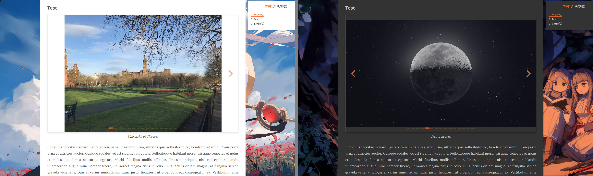

# hexo-splide-carousel
<p align="center">
    <a href="https://github.com/Siriusq/hexo-splide-carousel/blob/master/README.md"></a>
    <a href="https://siriusq.top/splide-demo.html"></a>
    <a href="https://github.com/Siriusq/hexo-splide-carousel/blob/master/LICENSE"></a>
    <a href="https://hexo.io/"></a>
    <a href="https://www.npmjs.com/"></a>
</p>



一个为 **Hexo** 博客提供的包，通过 **Splide.js** 和 **medium-zoom** 库提供图片轮播和图片缩放功能，适配 **NexT** 主题。

## 功能
- 集成 [Splide.js](https://splidejs.com/)，用于创建响应式、可自定义的图片轮播组件。
- 集成 [medium-zoom](https://medium-zoom.francoischalifour.com/) 库，实现图片平滑且简洁的缩放效果。
- 提供多种自定义样式选项，支持深色模式。
- 更多 Splide 选项可以添加到配置文件中，但不能保证所有选项都能正常工作。
- 兼容 NexT 主题的 pjax 功能。
- 轮播组件初始化时会占据固定的高度，开启 NexT 主题的懒加载后，点击目录跳转位置准确。

## 安装
1. 通过 npm 安装：
   ```bash
   npm install hexo-splide-carousel
   ```
2. 在博客根目录下的 Hexo 配置文件 `_config.yml` 中添加以下配置选项：
   ```yaml
   # 图片轮播缩放
   splide:
     cdn: unpkg  # 可选项：unpkg, cdnjs, jsdelivr
     options:
       heightRatio: 0.618        # 宽高比
       lazyLoad: false           # 懒加载，可选项：false, 'nearby', 'sequential'
       type: 'slide'             # 类型，可选项：'loop', 'slide'
       autoplay: false           # 自动播放
       interval: 3000            # 自动播放时间间隔
       pauseOnHover: true        # 鼠标悬停时暂停自动播放

     styles:
       arrowColor: '#fc8d5d'             # 左右切换箭头颜色
       arrowHoverColor: '#fc6423'        # 悬停时的左右切换箭头颜色
       paginationColor: '#fc8d5d'        # 非激活状态下的分页按钮颜色
       paginationActiveColor: '#fc6423'  # 激活状态下的分页按钮颜色
       paginationHoverColor: '#fc6423'   # 悬停时的分页按钮颜色
       borderRadius: 1px                 # 边框圆角半径
       borderColor:
         light: "#eee"  # 亮色主题边框颜色
         dark: "#444"   # 深色主题边框颜色
       shadowColor:
         light: "rgba(0, 0, 0, 0.1)"  # 亮色主题阴影颜色
         dark: "rgba(0, 0, 0, 0.3)"   # 深色主题阴影颜色

     dark_mode: auto  # 深色模式，可选项：true, false, auto. auto 模式会根据浏览器主题自动设置
     enable_medium_zoom: false  # 是否启用 medium zoom，请不要与主题中的 medium zoom 同时启用
   ```

## 使用
要创建图片轮播，请将图片包裹在 `` 或者 `` 标签中，例如：
```




```
以及
```




```
更多使用方法请访问[Hexo Splide Carousel 在线演示](https://siriusq.top/splide-demo.html)

## 配置
### Splide
在`_config.yml` 中的 `options` 部分是 Splide 的全局默认设置，此处设置的选项会应用于所有的轮播组件。你可以在这里添加更多的 [Splide 选项](https://splidejs.com/guides/options/#options)，但不保证所有选项都能正常工作。
```yaml
splide:
  options:
    heightRatio: 0.618        #宽高比
    lazyLoad: false           #懒加载，可选项：false, 'nearby', 'sequential'
    type: 'slide'             #类型，可选项：'loop', 'slide'
    autoplay: false           #自动播放
    interval: 3000            #自动播放时间间隔
    pauseOnHover: true        #鼠标悬停时暂停自动播放
    # 更多的 Splide 选项可以在这里添加
```

你还可以在 markdown 文件的`` 标签中添加局部设置选项，选项间使用空格分隔，局部设置项仅对标签对应的轮播组件生效，优先级高于全局默认设置。例如下面的配置就会为当前轮播组件开启循环和自动播放：
```




```

### medium-zoom
- `_config.yml` 中的 `medium_zoom.enabled` 选项可以控制是否使用 medium-zoom 缩放功能。
- 无论图片是否包裹在 `` 标签内，缩放功能始终可用。
- 此项开启时，请不要同时启用主题自带的 medium-zoom 或 fancybox 功能。

## 依赖
- [Splide @4.1.4](https://github.com/Splidejs/splide)
- [medium-zoom @1.1.0](https://github.com/francoischalifour/medium-zoom)

## 已知问题
- 启用 medium-zoom 时，有概率导致某些图片无法被正确放大。详情见 [images in a row with hardcoded height, look bad when zoomed in #147](https://github.com/francoischalifour/medium-zoom/issues/147)。
- 目前轮播组件的深色模式是根据浏览器的明暗主题调整的，不支持一些主题自带的明暗主题切换功能，因为每个主题对深色模式的处理方式不同，不可能为每个主题都做适配。
- 目前已经测试过 NexT 主题和 Butterfly 主题，可以使用，其他主题不保证能够正常使用。另外，碍于本人有限的前端知识，轮播组件只对 NexT 主题有相应适配。
- 尺寸小于轮播窗口的图片将会被放大至填满轮播窗口。
- 请勿启用主题内置的 medium-zoom 功能，它会导致轮播组件内的图片在缩放时比例失调。如有图片缩放需要，请使用包中经过适配的 medium-zoom 或者主题提供的 fancybox。
- Splide 提供的 lazyload 功能与主题提供的 fancybox 存在冲突，两者同时开启时 fancybox 无法获取图片路径，如果要使用 fancybox，请将 Splide 的 lazyLoad 设置为 false。
- 不兼容 Butterfly 主题内置的 lazyload 功能。
- Splide 的 lazyload 功能开启时会固定加载轮播中的首张图片，无论是否启用 NexT 主题中的 lazyload。 
- 为解决冲突问题，在含有轮播组件的页面中，fancybox 的 `placeFocusBack` 功能会被禁用，即关闭 fancybox 的缩放窗口后，页面不会跳转至关闭前显示的图片所在的位置。

## 版本更新日志

### 1.1.0
- 新增在 markdown 文件中使用的轮播标签 ``。

### 1.2.0
- 调整了 Splide 的懒加载功能，以兼容 NexT 主题内置的 fancybox 缩放功能。

### 1.2.1
- 解决了 fancybox 的 `placeFocusBack` 功能造成的轮播组件分页混乱问题。
- 修复了 fancybox 将 splide 为循环轮播组件创建的克隆图片添加到组件中的问题。
- 增大了分页按钮的可点击区域。

## 许可证
本项目采用 MIT 许可证。